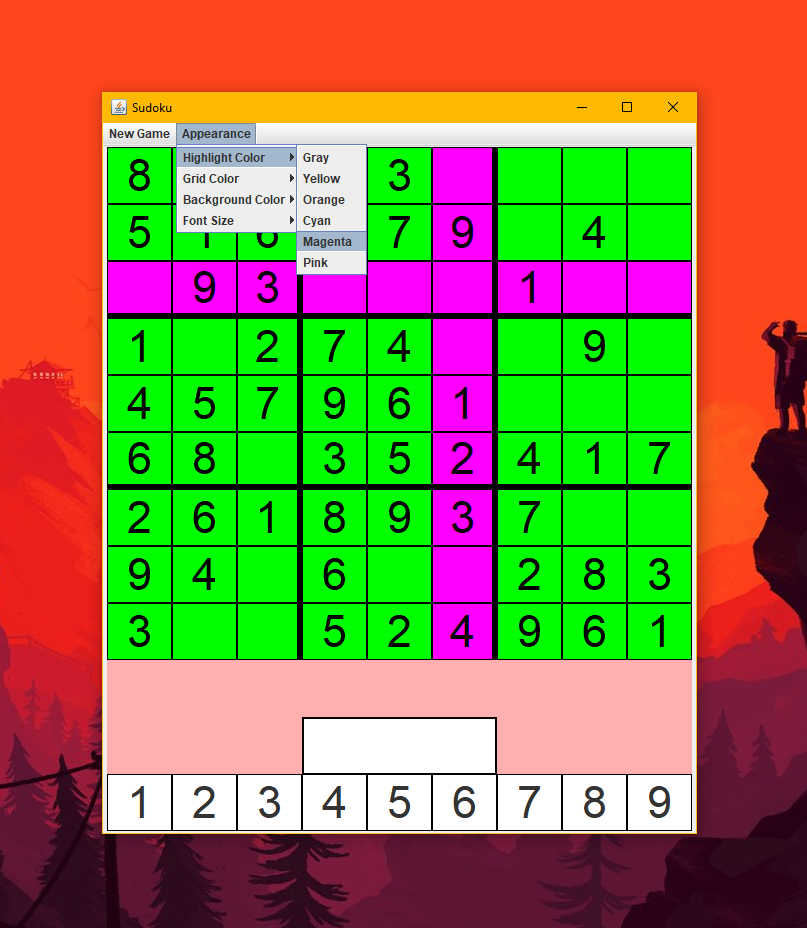

# Game of Sudoku
A simple Java GUI Desktop App of Sudoku.

# Here is how it works
1. Select the option "New Game" at the top to start a new game, then select a difficulty level. A unique board will be generated.

2. Click on an empty square to highlight it, then press one of the bottom numbers (1-9) to make a guess. You can also click on squares that already contain numbers. Doing so will highlight all of the other squares on the board with the same number filled in. 

3. Do your best to fill out the entire board, but be careful! You can only make 3 mistakes! If you guess wrong 3 times you lose!

4. You can customize the appearance of the game to your liking. You can change the font size, grid color, background-color and highlighter color if you don't like the defaults. 

# How to run the application
1. Download java runtime environment (jre) version 8 <a href="https://www.oracle.com/technetwork/java/javase/downloads/jre8-downloads-2133155.html">here</a> if you don't have it already.
2. Download and double-click on the executable InteractiveSudokuGame.jar file.

# About This Project
Currently, I am a 2nd year undergrad at UNCC studying computer science and concentrating in software engineering. As of now (1/21/20), this is my biggest project. I put many hours in learning how to use swing and this is what I came up with. It is not the cleanest or most organized project, but it's a start. 

# Author
<a href="https://github.com/btror">Brandon</a>
